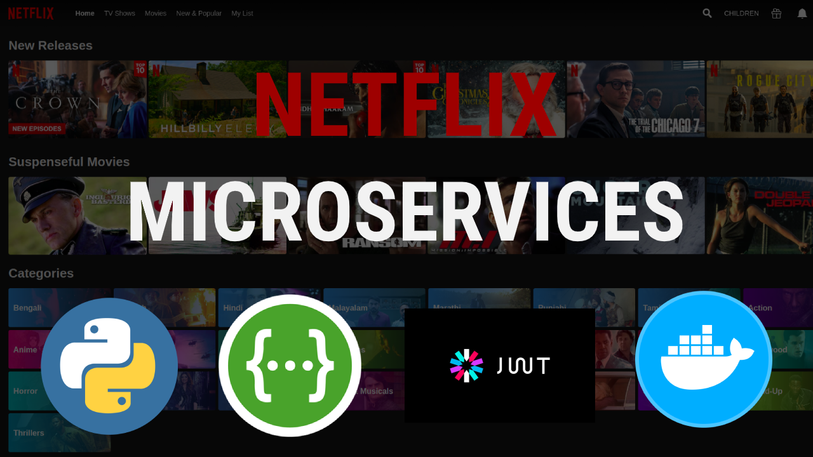
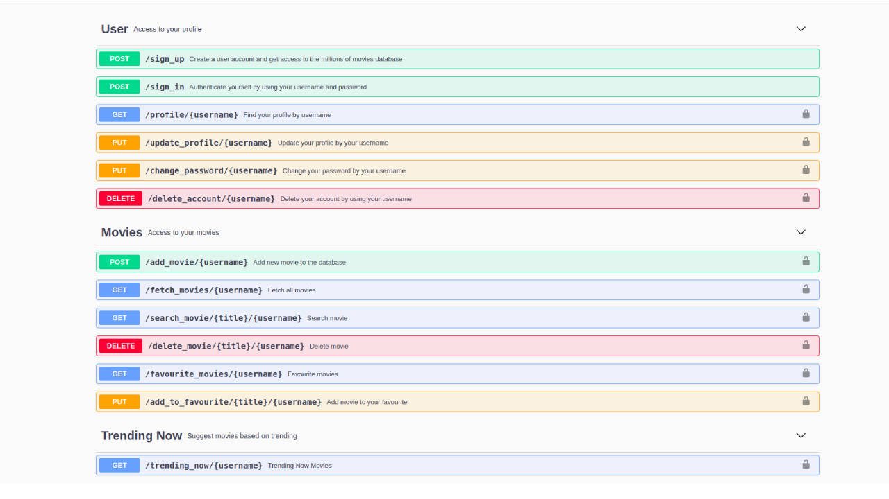

## Python Flask Microservices
The idea behind this application is to demonstrate the microservices architecture of today's modern system. In this demo, I have tried to show the basic microservices REST-API concepts of a tech & entertainment industry (i.e [Netflix](https://netflix.com)), and if we look at the system design of Netflix, it runs around more than 10,000+ microservices to manage the entire system, so in system-design, it's quite important to understand this concept.



## Technical Overview
The Proof of Concept written using python and it uses a flask web framework to define the routes and to store the data in the server it uses mongodb database, and for authentication, it uses [JWT Token](https://jwt.io/) framework.

In this project, you will find three different types of microservices.

1. Users
2. Movies
3. Trending Now

### Swagger API Documentation
The Swagger API docs can be accessible via [http://127.0.0.1:5000/api/docs](http://127.0.0.1:5000/api/docs) and to test the API endpoints you need to authorize yourself using your jwt access token.



### Installation
``````````````````````````````````````````````````````````````````````````````````
git clone https://github.com/anshumanpattnaik/python-flask-microservices
cd python-flask-microservices
pip install -r requirements.txt
source venv/bin/activate
python3 run.py

Open http://127.0.0.1:5000 to view in the browser.
```````````````````````````````````````````````````````````````````````````````````

### Build and run docker image

```````````````````````````````````````````````````````
docker build -t python-flask-microservices .
```````````````````````````````````````````````````````

```````````````````````````````````````````````````````````````````````````````
docker run -it --name python-container -p 5000:5000 python-flask-microservices
```````````````````````````````````````````````````````````````````````````````

### License
This project is licensed under the [MIT License](LICENSE)


Real-Time Equity Market Data Simulation
This project implements a real-time equity market data simulation system using a microservices architecture deployed on Azure. The system generates, processes, and logs stock market data in real-time using Kafka, Redis, and Postman for interaction.

Overview
The system consists of three microservices:

Market Data Simulator:

Generates simulated stock market data.
Publishes the data to a Kafka topic (equity_market_data).
Data Consumer:

Consumes stock market data from Kafka.
Stores the data in a Redis cache for real-time access.
Data Reader:

Reads the stored data from Redis.
Logs the data for real-time monitoring.
The lifecycle of the services is managed via two RESTful APIs: Start and Stop, which can be triggered using Postman.

Features
Simulates stock market data fields:
ticker: Stock ticker symbol (e.g., "AAPL", "GOOG").
bid_price, ask_price, last_trade_price: Float values representing market prices.
volume: Integer representing trading volume.
timestamp: ISO 8601 formatted datetime.
Utilizes Kafka for real-time data streaming.
Uses Redis for low-latency data storage.
Deployed on Azure for scalability and fault tolerance.
Architecture
Microservices:

Each service is containerized using Docker.
Deployed and orchestrated on Azure Kubernetes Service (AKS).
Data Flow:

Market Data Simulator → Kafka (equity_market_data topic) → Data Consumer → Redis → Data Reader.
APIs:

POST /start: Starts all services and initializes the data flow.
POST /stop: Stops all services gracefully.
Tech Stack
Backend: Python, Flask
Data Streaming: Kafka
Caching: Redis
Deployment: Azure Kubernetes Service (AKS)
API Testing: Postman
Containerization: Docker
